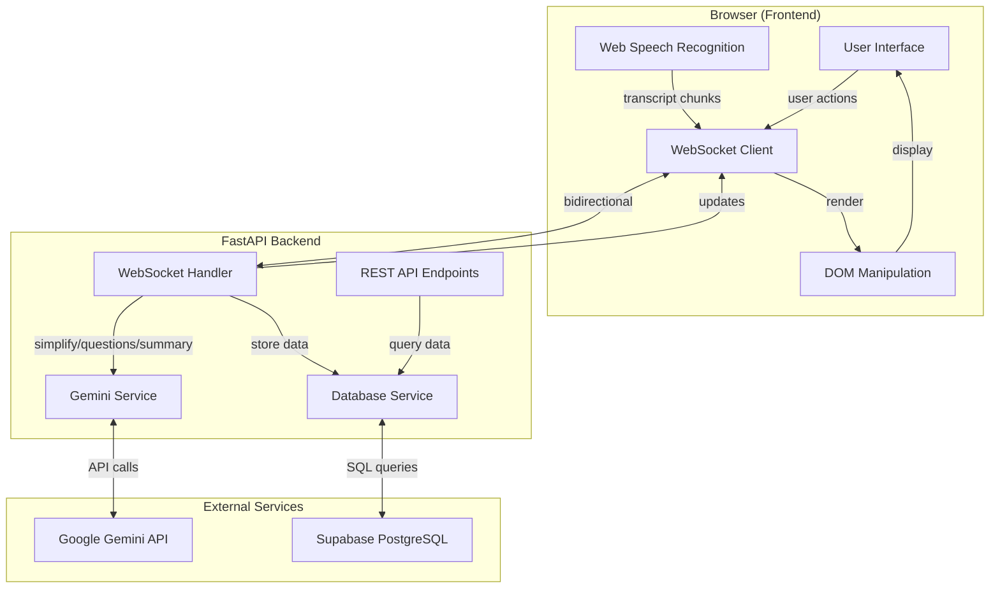

# Design Document: Sidekick AI Medical Appointment Assistant

## Overview

Sidekick is a real-time AI-powered medical appointment assistant that bridges the communication gap between healthcare providers and patients. The system leverages browser-based speech recognition, WebSocket communication, and Google's Gemini AI to provide instant medical terminology simplification, intelligent question suggestions, and comprehensive visit summaries.

The architecture follows a client-server model where the browser handles speech recognition locally (using the Web Speech API), while the backend orchestrates AI processing, data persistence, and real-time communication. This design minimizes latency, reduces server load, and provides a responsive user experience even during continuous conversations.

**Key Design Principles:**
- **Real-time First**: All operations prioritize low latency and immediate feedback
- **Progressive Enhancement**: Core functionality works with graceful degradation for unsupported features
- **Privacy by Design**: No audio storage, minimal data retention, user-controlled deletion
- **Scalability**: Async architecture supports multiple concurrent sessions
- **Simplicity**: Vanilla JavaScript frontend with zero build complexity

## Architecture

### System Architecture Diagram



### Communication Flow

**Session Initialization:**
1. User opens application → Frontend loads
2. Frontend establishes WebSocket connection → Backend creates session in database
3. User clicks "Start Recording" → Web Speech API activates
4. Speech recognition begins → Interim results display locally

**Real-Time Processing Loop:**
1. Speech segment finalized → Frontend sends transcript chunk via WebSocket
2. Backend receives chunk → Stores in database
3. Backend sends chunk to Gemini API → Requests simplifications and questions
4. Gemini returns results → Backend forwards to Frontend via WebSocket
5. Frontend receives updates → Updates UI panels immediately
6. Loop continues until user stops recording

**Session Termination:**
1. User clicks "Stop Recording" → Frontend sends end_session message
2. Backend compiles full transcript → Sends to Gemini for summary
3. Gemini generates structured summary → Backend stores in database
4. Backend sends summary to Frontend → Frontend displays summary view
5. WebSocket connection closes → Session marked as ended

### Technology Stack Rationale

| Component | Technology | Rationale |
|-----------|-----------|-----------|
| **Frontend** | Vanilla HTML/CSS/JS | Zero build step, fast iteration, no framework overhead |
| **Speech Recognition** | Web Speech API | Built into Chrome/Edge, free, real-time, no server processing |
| **Backend Framework** | FastAPI | Native async/await, WebSocket support, automatic API docs |
| **AI Engine** | Gemini 2.0 Flash | Free tier (15 RPM), excellent medical understanding, JSON mode |
| **Database** | Supabase PostgreSQL | Managed service, scalable, real-time capabilities, free tier |
| **WebSocket** | Native FastAPI | Low latency, bidirectional, connection pooling |
| **Deployment** | Uvicorn | ASGI server, production-ready, simple configuration |

## Components and Interfaces

### Frontend Components

#### 1. Speech Recognition Module (`speech.js`)

**Responsibility:** Manage browser-based speech recognition lifecycle

**Interface:**
```javascript
class SpeechRecognitionManager {
  constructor(onTranscript, onError)
  start()
  stop()
  isSupported()
}
```

**Key Methods:**
- `start()`: Initialize SpeechRecognition with continuous mode and interim results
- `stop()`: Terminate recognition and clean up resources
- `isSupported()`: Check browser compatibility
- `onTranscript(text, isFinal)`: Callback for transcript chunks
- `onError(error)`: Callback for recognition errors

**Implementation Details:**
- Uses `webkitSpeechRecognition` or `SpeechRecognition` API
- Configured with `continuous = true` and `interimResults = true`
- Automatically restarts on error (up to 3 attempts)
- Sends only final results to backend to reduce noise

#### 2. WebSocket Client (`app.js`)

**Responsibility:** Manage bidirectional communication with backend

**Interface:**
```javascript
class WebSocketClient {
  constructor(url)
  connect()
  disconnect()
  send(message)
  onMessage(handler)
  onError(handler)
  onClose(handler)
}
```

**Message Types:**
```javascript
// Client → Server
{type: "transcript", text: string, language: string}
{type: "end_session"}

// Server → Client
{type: "simplification", terms: [{term: string, explanation: string}]}
{type: "questions", suggestions: [string]}
{type: "translation", text: string}
{type: "summary", data: {title, diagnosis, medications, instructions, follow_up, key_points}}
{type: "error", message: string}
```

**Connection Management:**
- Automatic reconnection with exponential backoff (1s, 2s, 4s)
- Heartbeat ping every 30 seconds to keep connection alive
- Message queue for offline resilience
- Connection state tracking (connecting, connected, disconnected, error)

#### 3. UI Manager (`ui.js`)

**Responsibility:** Update DOM elements based on incoming data

**Interface:**
```javascript
class UIManager {
  updateTranscript(text, isFinal)
  addSimplification(term, explanation)
  updateQuestions(questions)
  showTranslation(text)
  displaySummary(summary)
  setRecordingState(isRecording)
  showError(message)
  clearSession()
}
```

**UI Panels:**
- **Live Transcript Panel**: Scrollable div with auto-scroll to bottom
- **Simplified Terms Panel**: List of term-explanation pairs with highlighting
- **Suggested Questions Panel**: Numbered list of clickable questions
- **Translation Panel**: Collapsible section showing translated text
- **Summary View**: Modal or dedicated page with structured summary fields

**Visual Feedback:**
- Recording indicator (pulsing red dot)
- Loading spinners during AI processing
- Smooth animations for new content
- Toast notifications for errors

### Backend Components

#### 1. WebSocket Handler (`main.py`)

**Responsibility:** Manage WebSocket connections and route messages

**Endpoint:** `ws://localhost:8000/ws/session`

**Connection Lifecycle:**
```python
async def websocket_endpoint(websocket: WebSocket):
    await websocket.accept()
    session_id = await create_session()
    
    try:
        while True:
            message = await websocket.receive_json()
            await handle_message(websocket, session_id, message)
    except WebSocketDisconnect:
        await end_session(session_id)
```

**Message Handlers:**
- `handle_transcript()`: Store chunk, call Gemini for simplification/questions
- `handle_end_session()`: Generate summary, store in database, send to client
- `handle_error()`: Log error, send error message to client

**Concurrency:**
- Each WebSocket connection runs in its own async task
- Connection pool managed by FastAPI
- Gemini API calls use asyncio for non-blocking I/O

#### 2. Gemini Service (`gemini_service.py`)

**Responsibility:** Interface with Google Gemini API for all AI operations

**Interface:**
```python
class GeminiService:
    def __init__(self, api_key: str)
    async def simplify_terms(self, transcript: str) -> List[Dict[str, str]]
    async def suggest_questions(self, full_transcript: str) -> List[str]
    async def generate_summary(self, full_transcript: str) -> Dict
    async def translate_text(self, text: str, target_language: str) -> str
```

**Prompt Templates:**

**Medical Term Simplifier:**
```
You are a medical language simplifier. Given the following doctor-patient
conversation excerpt, identify ALL medical or clinical terms and explain
each in simple, patient-friendly language.

Transcript: "{transcript_chunk}"

Respond in this exact JSON format:
{
  "terms": [
    {"term": "medical term", "explanation": "simple explanation"}
  ]
}
If there are no medical terms, return {"terms": []}.
```

**Question Suggestion:**
```
You are a patient advocate. Based on this doctor-patient conversation,
suggest 2-3 clarification questions the patient could ask to better
understand their condition and treatment.

Conversation so far:
"{full_transcript}"

Respond in this exact JSON format:
{
  "questions": [
    "Question 1?",
    "Question 2?",
    "Question 3?"
  ]
}
```

**Visit Summary:**
```
You are a medical visit summarizer. Create a structured summary of this
doctor-patient conversation.

Full transcript:
"{full_transcript}"

Respond in this exact JSON format:
{
  "title": "Brief visit title",
  "diagnosis": "Main diagnosis or concern discussed",
  "medications": ["medication 1", "medication 2"],
  "instructions": ["instruction 1", "instruction 2"],
  "follow_up": "Follow-up plan",
  "key_points": ["key point 1", "key point 2"]
}
```

**Translation:**
```
Translate the following medical explanation into {target_language}.
Keep it simple and patient-friendly. Do not use technical jargon.

Text: "{text}"

Respond with only the translated text.
```

**API Configuration:**
- Model: `gemini-2.0-flash-exp`
- Temperature: 0.3 (for consistent medical terminology)
- Max tokens: 1024
- JSON mode: Enabled for structured responses
- Rate limiting: 15 requests per minute (free tier)
- Timeout: 10 seconds per request
- Retry logic: 3 attempts with exponential backoff

#### 3. Database Service (`database.py`)

**Responsibility:** Manage all database operations with Supabase PostgreSQL

**Interface:**
```python
class DatabaseService:
    def __init__(self, connection_string: str)
    async def init_db()
    async def create_session(language: str) -> str
    async def end_session(session_id: str)
    async def add_transcript_chunk(session_id: str, text: str)
    async def add_simplification(session_id: str, term: str, explanation: str)
    async def save_summary(session_id: str, summary: Dict)
    async def get_all_sessions() -> List[Dict]
    async def get_session_details(session_id: str) -> Dict
    async def delete_session(session_id: str)
```

**Connection Management:**
- Connection pooling with asyncpg
- Pool size: 10 connections
- Connection timeout: 5 seconds
- Automatic reconnection on failure

#### 4. REST API Endpoints (`main.py`)

**Endpoints:**

```python
@app.get("/")
async def serve_frontend():
    """Serve main application HTML"""
    return FileResponse("frontend/index.html")

@app.get("/api/sessions")
async def list_sessions():
    """Return all sessions with basic info"""
    return await db.get_all_sessions()

@app.get("/api/sessions/{session_id}")
async def get_session(session_id: str):
    """Return full session details including transcript and summary"""
    return await db.get_session_details(session_id)

@app.delete("/api/sessions/{session_id}")
async def delete_session(session_id: str):
    """Delete session and all related data"""
    await db.delete_session(session_id)
    return {"status": "deleted"}
```

**Response Formats:**

```python
# GET /api/sessions
{
  "sessions": [
    {
      "id": "uuid",
      "title": "Hypertension Follow-up",
      "language": "en",
      "created_at": "2024-01-15T10:30:00Z",
      "ended_at": "2024-01-15T10:45:00Z"
    }
  ]
}

# GET /api/sessions/{id}
{
  "session": {
    "id": "uuid",
    "title": "Hypertension Follow-up",
    "language": "en",
    "created_at": "2024-01-15T10:30:00Z",
    "ended_at": "2024-01-15T10:45:00Z"
  },
  "transcript": [
    {"text": "...", "timestamp": "2024-01-15T10:30:05Z"}
  ],
  "simplifications": [
    {"term": "hypertension", "explanation": "high blood pressure", "timestamp": "..."}
  ],
  "summary": {
    "title": "...",
    "diagnosis": "...",
    "medications": [],
    "instructions": [],
    "follow_up": "...",
    "key_points": []
  }
}
```

## Data Models

### Database Schema (Supabase PostgreSQL)

```sql
-- Sessions table
CREATE TABLE sessions (
    id UUID PRIMARY KEY DEFAULT gen_random_uuid(),
    title TEXT,
    language TEXT DEFAULT 'en',
    created_at TIMESTAMPTZ DEFAULT NOW(),
    ended_at TIMESTAMPTZ
);

CREATE INDEX idx_sessions_created_at ON sessions(created_at DESC);

-- Transcript chunks table
CREATE TABLE transcript_chunks (
    id SERIAL PRIMARY KEY,
    session_id UUID REFERENCES sessions(id) ON DELETE CASCADE,
    text TEXT NOT NULL,
    timestamp TIMESTAMPTZ DEFAULT NOW()
);

CREATE INDEX idx_transcript_session ON transcript_chunks(session_id, timestamp);

-- Simplifications table
CREATE TABLE simplifications (
    id SERIAL PRIMARY KEY,
    session_id UUID REFERENCES sessions(id) ON DELETE CASCADE,
    term TEXT NOT NULL,
    explanation TEXT NOT NULL,
    timestamp TIMESTAMPTZ DEFAULT NOW()
);

CREATE INDEX idx_simplifications_session ON simplifications(session_id, timestamp);

-- Summaries table
CREATE TABLE summaries (
    id SERIAL PRIMARY KEY,
    session_id UUID REFERENCES sessions(id) ON DELETE CASCADE UNIQUE,
    title TEXT,
    diagnosis TEXT,
    medications JSONB,
    instructions JSONB,
    follow_up TEXT,
    key_points JSONB,
    full_summary TEXT,
    created_at TIMESTAMPTZ DEFAULT NOW()
);

CREATE INDEX idx_summaries_session ON summaries(session_id);
```

### Pydantic Models (`models.py`)

```python
from pydantic import BaseModel, Field
from typing import List, Optional
from datetime import datetime
from uuid import UUID

class TranscriptMessage(BaseModel):
    type: str = "transcript"
    text: str
    language: str = "en"

class SimplificationTerm(BaseModel):
    term: str
    explanation: str

class SimplificationMessage(BaseModel):
    type: str = "simplification"
    terms: List[SimplificationTerm]

class QuestionsMessage(BaseModel):
    type: str = "questions"
    suggestions: List[str]

class TranslationMessage(BaseModel):
    type: str = "translation"
    text: str

class SummaryData(BaseModel):
    title: str
    diagnosis: str
    medications: List[str]
    instructions: List[str]
    follow_up: str
    key_points: List[str]

class SummaryMessage(BaseModel):
    type: str = "summary"
    data: SummaryData

class ErrorMessage(BaseModel):
    type: str = "error"
    message: str

class Session(BaseModel):
    id: UUID
    title: Optional[str]
    language: str
    created_at: datetime
    ended_at: Optional[datetime]

class TranscriptChunk(BaseModel):
    id: int
    session_id: UUID
    text: str
    timestamp: datetime

class Simplification(BaseModel):
    id: int
    session_id: UUID
    term: str
    explanation: str
    timestamp: datetime

class Summary(BaseModel):
    id: int
    session_id: UUID
    title: Optional[str]
    diagnosis: Optional[str]
    medications: List[str]
    instructions: List[str]
    follow_up: Optional[str]
    key_points: List[str]
    created_at: datetime

class SessionDetail(BaseModel):
    session: Session
    transcript: List[TranscriptChunk]
    simplifications: List[Simplification]
    summary: Optional[Summary]
```


## Correctness Properties

*A property is a characteristic or behavior that should hold true across all valid executions of a system—essentially, a formal statement about what the system should do. Properties serve as the bridge between human-readable specifications and machine-verifiable correctness guarantees.*

### Property Reflection

After analyzing all acceptance criteria, I identified several areas of redundancy:

1. **WebSocket message handling**: Multiple properties test that "for any X message, it's sent/received via WebSocket" - these can be consolidated into a single property about WebSocket message delivery
2. **Database persistence**: Multiple properties test that "for any X, it's stored in database with all fields" - these can be consolidated into a single property about data persistence completeness
3. **UI display properties**: Multiple properties test that "for any X received, it's displayed in panel Y" - these can be consolidated into properties about UI update consistency
4. **Error handling**: Multiple properties test that "for any error of type X, it's handled gracefully" - these can be consolidated into a general error handling property
5. **Performance timing**: Multiple properties test timing constraints (2s, 10s, 100ms) - these should be kept separate as they test different operations

The following properties represent the unique, non-redundant correctness guarantees for the system.

### Core Functional Properties

**Property 1: Speech Recognition Activation**
*For any* microphone permission grant event, the Web Speech API should be activated in continuous recognition mode with interim results enabled.
**Validates: Requirements 1.2**

**Property 2: Transcript Chunk Transmission**
*For any* finalized speech segment, a WebSocket message containing the transcript text should be sent to the backend within 100ms.
**Validates: Requirements 1.4, 4.3**

**Property 3: Speech Recognition Error Recovery**
*For any* speech recognition error, the system should log the error and attempt to restart recognition automatically, up to 3 attempts.
**Validates: Requirements 1.7**

**Property 4: Medical Term Simplification Request**
*For any* transcript chunk received by the backend, the Gemini API should be called with a simplification prompt within 500ms.
**Validates: Requirements 2.1**

**Property 5: Simplification Generation Completeness**
*For any* medical term identified by the Gemini API, a plain-language simplification should be generated and returned.
**Validates: Requirements 2.2**

**Property 6: Simplification Response Time**
*For any* simplification request, the results should be sent to the frontend via WebSocket within 2 seconds of receiving the transcript chunk.
**Validates: Requirements 2.3**

**Property 7: Simplification Display Completeness**
*For any* simplification received by the frontend, the rendered UI should contain both the original medical term and its plain-language explanation.
**Validates: Requirements 2.4**

**Property 8: Simplification Accumulation Invariant**
*For any* session, adding a new simplification should increase the session's simplification list size by exactly 1.
**Validates: Requirements 2.6**

**Property 9: Simplification Persistence Completeness**
*For any* simplification generated, a database record should be created containing session_id, term, explanation, and timestamp fields.
**Validates: Requirements 2.7**

**Property 10: Transcript Context Accumulation**
*For any* sequence of transcript chunks received, the conversation context should contain all chunks in the order they were received.
**Validates: Requirements 3.1**

**Property 11: Question Suggestion Cardinality**
*For any* question generation request with sufficient context, the Gemini API should return between 2 and 3 clarification questions.
**Validates: Requirements 3.3**

**Property 12: Question Suggestion Transmission**
*For any* question suggestions generated, they should be sent to the frontend via WebSocket within 2 seconds.
**Validates: Requirements 3.4**

**Property 13: Question Suggestion Display**
*For any* question suggestions received by the frontend, all questions should be displayed in the Suggested Questions panel.
**Validates: Requirements 3.5**

**Property 14: Question Suggestion Updates**
*For any* new question suggestions received, they should replace the previous questions in the UI (not append).
**Validates: Requirements 3.6, 10.5**

**Property 15: WebSocket Session Creation**
*For any* WebSocket connection established, a new session record should be created in the database with a unique ID, language preference, and created_at timestamp.
**Validates: Requirements 4.2, 8.3**

**Property 16: WebSocket Message Processing Time**
*For any* message sent via WebSocket (in either direction), it should be received and processed within 100ms under normal network conditions.
**Validates: Requirements 4.3, 4.4**

**Property 17: WebSocket Reconnection Attempts**
*For any* WebSocket connection loss, the system should attempt to reconnect automatically up to 3 times with exponential backoff before displaying an error.
**Validates: Requirements 4.5, 11.2**

**Property 18: WebSocket Message Type Support**
*For any* valid WebSocket message type (transcript, simplification, questions, translation, summary, end_session), the system should process it correctly without errors.
**Validates: Requirements 4.7**

**Property 19: Session End Transcript Compilation**
*For any* end_session message received, all transcript chunks for that session should be compiled into a single ordered string.
**Validates: Requirements 5.2**

**Property 20: Summary Generation Request**
*For any* compiled full transcript, a summary generation request should be sent to the Gemini API with the appropriate prompt.
**Validates: Requirements 5.3**

**Property 21: Summary Structure Completeness**
*For any* visit summary generated by the Gemini API, it should contain all required fields: title, diagnosis, medications (array), instructions (array), follow_up, and key_points (array).
**Validates: Requirements 5.4**

**Property 22: Summary Persistence**
*For any* visit summary generated, it should be stored in the summaries table with the session_id and all structured fields.
**Validates: Requirements 5.5, 8.6**

**Property 23: Summary Transmission**
*For any* visit summary stored in the database, it should be sent to the frontend via WebSocket immediately after storage.
**Validates: Requirements 5.6**

**Property 24: Summary Display Completeness**
*For any* visit summary received by the frontend, all structured fields should be displayed in the summary view.
**Validates: Requirements 5.7**

**Property 25: Summary Generation Time**
*For any* session end event, the visit summary should be generated and sent to the frontend within 10 seconds.
**Validates: Requirements 5.8**

**Property 26: Language Preference Storage**
*For any* language selection other than English, the language preference should be stored in the session record.
**Validates: Requirements 6.2**

**Property 27: Translation Request Trigger**
*For any* simplification generated when a non-English language is selected, a translation request should be sent to the Gemini API.
**Validates: Requirements 6.3**

**Property 28: Translation Transmission**
*For any* translated text returned by the Gemini API, it should be sent to the frontend via WebSocket within 2 seconds.
**Validates: Requirements 6.4**

**Property 29: Translation Display**
*For any* translated text received by the frontend, it should be displayed in the dedicated translation panel.
**Validates: Requirements 6.5**

**Property 30: Language Change Re-translation**
*For any* language selection change mid-session, all existing simplifications should be re-translated to the new language.
**Validates: Requirements 6.7**

**Property 31: Session List Chronological Ordering**
*For any* list of sessions retrieved from the database, they should be ordered by created_at timestamp in descending order (newest first).
**Validates: Requirements 7.4**

**Property 32: Session Display Completeness**
*For any* session displayed in the history view, it should show the session title, date, and summary preview.
**Validates: Requirements 7.5**

**Property 33: Session Detail Completeness**
*For any* session detail request, the response should include the session metadata, all transcript chunks, all simplifications, and the visit summary.
**Validates: Requirements 7.7, 12.5**

**Property 34: Session Delete Button Presence**
*For any* session displayed in the history view, a delete button should be present and functional.
**Validates: Requirements 7.8**

**Property 35: Session Deletion Cascade**
*For any* session deletion request, all related records in transcript_chunks, simplifications, and summaries tables should be deleted (cascade delete).
**Validates: Requirements 7.9, 12.7**

**Property 36: Session Deletion UI Update**
*For any* successful session deletion, the session should be removed from the history view immediately without requiring a page refresh.
**Validates: Requirements 7.10**

**Property 37: Transcript Chunk Persistence**
*For any* transcript chunk received by the backend, it should be inserted into the transcript_chunks table with session_id, text, and timestamp.
**Validates: Requirements 8.4**

**Property 38: Session End Timestamp Update**
*For any* session end event, the sessions table should be updated with the ended_at timestamp.
**Validates: Requirements 8.7**

**Property 39: Gemini API Prompt Selection**
*For any* Gemini API call, the appropriate prompt template should be used based on the operation type (simplification, question generation, summary, or translation).
**Validates: Requirements 9.4**

**Property 40: Gemini API Response Parsing**
*For any* valid JSON response from the Gemini API, the system should successfully parse it and extract the relevant fields without errors.
**Validates: Requirements 9.5**

**Property 41: Gemini API Error Handling**
*For any* error response from the Gemini API, the system should log the error and return a user-friendly error message to the frontend.
**Validates: Requirements 9.6, 11.3**

**Property 42: Gemini API Rate Limiting**
*For any* sequence of Gemini API requests, the rate should not exceed 15 requests per minute.
**Validates: Requirements 9.7**

**Property 43: Rate Limit Queue Behavior**
*For any* request that would exceed the rate limit, it should be queued and processed when capacity becomes available.
**Validates: Requirements 9.8**

**Property 44: Transcript Panel Auto-scroll**
*For any* new transcript text appended to the Live Transcript panel, the panel should automatically scroll to show the latest content.
**Validates: Requirements 10.3**

**Property 45: Simplification Term Highlighting**
*For any* simplification displayed in the Simplified Terms panel, the original medical term should be visually highlighted or distinguished from the explanation.
**Validates: Requirements 10.4**

**Property 46: Recording State Visual Indicator**
*For any* active recording state, a visual indicator (such as a red recording icon) should be displayed in the UI.
**Validates: Requirements 10.7**

**Property 47: Translation Panel Display**
*For any* active translation feature (non-English language selected), the translation panel should be visible in the UI.
**Validates: Requirements 10.10**

**Property 48: Speech API Error Display**
*For any* Web Speech API error, a user-friendly error message should be displayed in the UI.
**Validates: Requirements 11.1**

**Property 49: Gemini API Retry Logic**
*For any* Gemini API unavailability, requests should be retried up to 3 times with exponential backoff (1s, 2s, 4s).
**Validates: Requirements 11.3**

**Property 50: Database Error Response**
*For any* database connection failure, the system should return a 503 Service Unavailable HTTP response.
**Validates: Requirements 11.4**

**Property 51: WebSocket Message Validation**
*For any* message received via WebSocket, the system should validate the message format and reject invalid messages with an error response.
**Validates: Requirements 11.5**

**Property 52: Session Creation Error Handling**
*For any* session creation failure, an error message should be displayed and the recording button should remain disabled.
**Validates: Requirements 11.6**

**Property 53: Error Logging Completeness**
*For any* error that occurs in the system, it should be logged with a timestamp, error type, and contextual information.
**Validates: Requirements 11.7**

**Property 54: Sessions API Response Format**
*For any* GET /api/sessions request, the response should be valid JSON containing an array of session objects with id, title, language, created_at, and ended_at fields.
**Validates: Requirements 12.3**

**Property 55: HTTP Status Code Correctness**
*For any* HTTP response, the status code should correctly reflect the outcome: 200 for success, 404 for not found, 500 for server errors, 503 for service unavailable.
**Validates: Requirements 12.9**

**Property 56: Transcript Processing Time**
*For any* transcript chunk sent to the backend, processing (including Gemini API call) should complete and results should be returned within 2 seconds.
**Validates: Requirements 13.1**

**Property 57: Gemini API Timeout**
*For any* Gemini API call, a timeout of 10 seconds should be enforced, after which the request should fail with a timeout error.
**Validates: Requirements 13.2**

**Property 58: Database Query Performance**
*For any* simple database query (single table, indexed lookup), execution should complete within 500ms.
**Validates: Requirements 13.3**

**Property 59: Message Order Preservation**
*For any* sequence of transcript chunks sent rapidly, they should be processed in the order received without dropping any messages.
**Validates: Requirements 13.5**

**Property 60: No Audio Storage**
*For any* session in the database, there should be no audio file or binary audio data stored—only text transcripts.
**Validates: Requirements 14.1**

**Property 61: HTTPS for Gemini API**
*For any* Gemini API request, the connection should use HTTPS protocol.
**Validates: Requirements 14.3**

**Property 62: Sensitive Data Sanitization in Logs**
*For any* log entry, it should not contain sensitive medical information (patient names, specific diagnoses, medications).
**Validates: Requirements 14.5**

**Property 63: Complete Session Deletion**
*For any* deleted session, no data should remain in any database table (sessions, transcript_chunks, simplifications, summaries).
**Validates: Requirements 14.6**

**Property 64: Database Schema Initialization Idempotence**
*For any* backend startup, the database schema should exist after initialization, regardless of whether it existed before.
**Validates: Requirements 15.3**


## Error Handling

### Error Categories and Strategies

#### 1. Browser Compatibility Errors

**Scenario:** Web Speech API not supported in browser

**Detection:**
```javascript
if (!('webkitSpeechRecognition' in window) && !('SpeechRecognition' in window)) {
  // Not supported
}
```

**Handling:**
- Display prominent error message: "Speech recognition is not supported in this browser. Please use Chrome or Edge."
- Disable recording button
- Provide link to supported browsers documentation

**Recovery:** None - requires user to switch browsers

#### 2. Microphone Permission Errors

**Scenario:** User denies microphone permission or no microphone available

**Detection:** Speech recognition `onerror` event with error code `not-allowed` or `audio-capture`

**Handling:**
- Display error message: "Microphone access is required. Please grant permission and try again."
- Show instructions for enabling microphone in browser settings
- Keep recording button enabled for retry

**Recovery:** User can click "Start Recording" again after granting permission

#### 3. Speech Recognition Errors

**Scenario:** Recognition fails due to network issues, no speech detected, or API errors

**Detection:** Speech recognition `onerror` event with various error codes

**Handling:**
```javascript
recognition.onerror = (event) => {
  console.error('Speech recognition error:', event.error);
  
  switch(event.error) {
    case 'no-speech':
      // Silent - don't show error, just continue listening
      break;
    case 'network':
      showError('Network error. Retrying...');
      attemptRestart();
      break;
    case 'aborted':
      // User stopped - no error needed
      break;
    default:
      showError('Recognition error. Restarting...');
      attemptRestart();
  }
};
```

**Recovery:** Automatic restart up to 3 times, then display persistent error

#### 4. WebSocket Connection Errors

**Scenario:** Connection fails, drops, or times out

**Detection:** WebSocket `onerror` and `onclose` events

**Handling:**
```javascript
class WebSocketClient {
  constructor() {
    this.reconnectAttempts = 0;
    this.maxReconnectAttempts = 3;
    this.reconnectDelay = 1000; // Start with 1 second
  }
  
  onClose() {
    if (this.reconnectAttempts < this.maxReconnectAttempts) {
      this.reconnectAttempts++;
      const delay = this.reconnectDelay * Math.pow(2, this.reconnectAttempts - 1);
      
      showNotification(`Connection lost. Reconnecting in ${delay/1000}s...`);
      setTimeout(() => this.connect(), delay);
    } else {
      showError('Unable to connect to server. Please refresh the page.');
    }
  }
}
```

**Recovery:** Exponential backoff reconnection (1s, 2s, 4s), then manual refresh required

#### 5. Gemini API Errors

**Scenario:** API key invalid, rate limit exceeded, service unavailable, timeout

**Detection:** HTTP error responses or timeout

**Handling:**
```python
class GeminiService:
    async def call_api(self, prompt: str, operation: str):
        try:
            response = await asyncio.wait_for(
                self.model.generate_content_async(prompt),
                timeout=10.0
            )
            return response.text
            
        except asyncio.TimeoutError:
            logger.error(f"Gemini API timeout for {operation}")
            raise APIError("AI service is taking too long. Please try again.")
            
        except Exception as e:
            if "quota" in str(e).lower() or "rate" in str(e).lower():
                logger.warning(f"Rate limit hit for {operation}")
                # Queue request for later
                await self.queue_request(prompt, operation)
                return None
            else:
                logger.error(f"Gemini API error: {e}")
                raise APIError("AI service unavailable. Please try again later.")
```

**Recovery:** 
- Timeout: Retry once, then fail gracefully
- Rate limit: Queue request and process when capacity available
- Other errors: Return cached/default response or skip feature

#### 6. Database Errors

**Scenario:** Connection failure, query timeout, constraint violation

**Detection:** Database exception during query execution

**Handling:**
```python
async def add_transcript_chunk(session_id: str, text: str):
    try:
        async with self.pool.acquire() as conn:
            await conn.execute(
                "INSERT INTO transcript_chunks (session_id, text) VALUES ($1, $2)",
                session_id, text
            )
    except asyncpg.exceptions.ForeignKeyViolationError:
        logger.error(f"Session {session_id} not found")
        raise HTTPException(status_code=404, detail="Session not found")
        
    except asyncpg.exceptions.PostgresError as e:
        logger.error(f"Database error: {e}")
        raise HTTPException(status_code=503, detail="Database unavailable")
        
    except Exception as e:
        logger.error(f"Unexpected database error: {e}")
        raise HTTPException(status_code=500, detail="Internal server error")
```

**Recovery:** 
- Connection errors: Retry with exponential backoff
- Constraint violations: Return 400 Bad Request with details
- Other errors: Return 503 Service Unavailable

#### 7. Invalid Data Errors

**Scenario:** Malformed WebSocket messages, invalid JSON, missing required fields

**Detection:** JSON parsing errors or Pydantic validation errors

**Handling:**
```python
async def handle_message(websocket: WebSocket, message: dict):
    try:
        msg_type = message.get("type")
        
        if msg_type == "transcript":
            validated = TranscriptMessage(**message)
            await process_transcript(websocket, validated)
            
        elif msg_type == "end_session":
            await process_end_session(websocket)
            
        else:
            await websocket.send_json({
                "type": "error",
                "message": f"Unknown message type: {msg_type}"
            })
            
    except ValidationError as e:
        logger.warning(f"Invalid message format: {e}")
        await websocket.send_json({
            "type": "error",
            "message": "Invalid message format"
        })
        
    except Exception as e:
        logger.error(f"Message handling error: {e}")
        await websocket.send_json({
            "type": "error",
            "message": "Failed to process message"
        })
```

**Recovery:** Send error message to client, continue processing other messages

### Error Response Format

All errors sent to the frontend follow this format:

```javascript
{
  "type": "error",
  "message": "User-friendly error message",
  "code": "ERROR_CODE", // Optional
  "details": {} // Optional additional context
}
```

### Logging Strategy

**Log Levels:**
- `DEBUG`: Detailed flow information (WebSocket messages, API calls)
- `INFO`: Normal operations (session start/end, successful API calls)
- `WARNING`: Recoverable errors (rate limits, retries)
- `ERROR`: Failures requiring attention (API errors, database errors)
- `CRITICAL`: System-level failures (startup failures, missing config)

**Log Format:**
```
[TIMESTAMP] [LEVEL] [COMPONENT] [SESSION_ID] Message
```

**Example:**
```
[2024-01-15 10:30:45] [ERROR] [GeminiService] [uuid-123] Gemini API timeout for simplification
```

**Sensitive Data Handling:**
- Never log full transcript text (only length/preview)
- Never log medical terms or simplifications
- Never log API keys or credentials
- Log only session IDs, not patient identifiers

## Testing Strategy

### Dual Testing Approach

The Sidekick system requires both unit tests and property-based tests to ensure comprehensive correctness:

- **Unit tests** verify specific examples, edge cases, and integration points
- **Property-based tests** verify universal properties across all inputs
- Together they provide comprehensive coverage: unit tests catch concrete bugs, property tests verify general correctness

### Property-Based Testing Configuration

**Library:** `hypothesis` for Python backend, `fast-check` for JavaScript frontend

**Configuration:**
- Minimum 100 iterations per property test (due to randomization)
- Each property test references its design document property
- Tag format: `# Feature: sidekick-medical-assistant, Property {number}: {property_text}`

**Example Property Test:**
```python
from hypothesis import given, strategies as st
import pytest

# Feature: sidekick-medical-assistant, Property 8: Simplification Accumulation Invariant
@given(
    session_id=st.uuids(),
    term=st.text(min_size=1, max_size=50),
    explanation=st.text(min_size=10, max_size=200)
)
@pytest.mark.asyncio
async def test_simplification_accumulation_invariant(session_id, term, explanation):
    """For any session, adding a new simplification should increase the list size by exactly 1"""
    
    # Get initial count
    initial_count = await db.get_simplification_count(session_id)
    
    # Add simplification
    await db.add_simplification(session_id, term, explanation)
    
    # Get new count
    new_count = await db.get_simplification_count(session_id)
    
    # Verify invariant
    assert new_count == initial_count + 1
```

### Test Organization

#### Backend Tests (`backend/tests/`)

```
tests/
├── unit/
│   ├── test_database.py          # Database operations
│   ├── test_gemini_service.py    # Gemini API integration
│   ├── test_websocket.py         # WebSocket message handling
│   └── test_models.py            # Pydantic model validation
├── property/
│   ├── test_properties_core.py   # Properties 1-20
│   ├── test_properties_data.py   # Properties 21-40
│   └── test_properties_api.py    # Properties 41-64
├── integration/
│   ├── test_session_flow.py      # End-to-end session lifecycle
│   └── test_api_endpoints.py     # REST API integration
└── conftest.py                   # Pytest fixtures
```

#### Frontend Tests (`frontend/tests/`)

```
tests/
├── unit/
│   ├── test_speech.test.js       # Speech recognition module
│   ├── test_websocket.test.js    # WebSocket client
│   └── test_ui.test.js           # UI manager
├── property/
│   └── test_properties.test.js   # Frontend properties
└── integration/
    └── test_e2e.test.js          # End-to-end browser tests
```

### Unit Test Coverage

**Critical Unit Tests:**

1. **Database Operations**
   - Session CRUD operations
   - Cascade delete behavior
   - Transaction rollback on error
   - Connection pool management

2. **Gemini Service**
   - Prompt template selection
   - JSON response parsing
   - Error handling for API failures
   - Rate limiting logic

3. **WebSocket Handler**
   - Message routing by type
   - Connection lifecycle management
   - Error message formatting
   - Concurrent connection handling

4. **Speech Recognition**
   - Browser compatibility detection
   - Error recovery logic
   - Interim vs final result handling

5. **UI Manager**
   - Panel updates with new data
   - Auto-scroll behavior
   - Error message display
   - State management

### Property-Based Test Coverage

Each correctness property from the design document should have a corresponding property-based test. Key properties to prioritize:

**High Priority (Core Functionality):**
- Property 8: Simplification Accumulation Invariant
- Property 10: Transcript Context Accumulation
- Property 21: Summary Structure Completeness
- Property 35: Session Deletion Cascade
- Property 40: Gemini API Response Parsing
- Property 51: WebSocket Message Validation
- Property 59: Message Order Preservation

**Medium Priority (Data Integrity):**
- Property 9: Simplification Persistence Completeness
- Property 33: Session Detail Completeness
- Property 37: Transcript Chunk Persistence
- Property 54: Sessions API Response Format
- Property 63: Complete Session Deletion

**Lower Priority (Performance & Edge Cases):**
- Property 6: Simplification Response Time
- Property 25: Summary Generation Time
- Property 42: Gemini API Rate Limiting
- Property 56: Transcript Processing Time

### Integration Testing

**Session Lifecycle Test:**
```python
@pytest.mark.asyncio
async def test_complete_session_lifecycle():
    """Test full session from start to summary generation"""
    
    # 1. Establish WebSocket connection
    async with websocket_client() as ws:
        
        # 2. Verify session created
        session_id = await get_session_id(ws)
        assert session_id is not None
        
        # 3. Send transcript chunks
        chunks = [
            "Doctor: Your blood pressure is elevated.",
            "Doctor: We may need to start an ACE inhibitor.",
            "Patient: What are the side effects?"
        ]
        
        for chunk in chunks:
            await ws.send_json({"type": "transcript", "text": chunk})
            
        # 4. Verify simplifications received
        simplifications = await collect_messages(ws, "simplification", timeout=5)
        assert len(simplifications) > 0
        assert any("blood pressure" in s["explanation"] for s in simplifications)
        
        # 5. Verify questions received
        questions = await collect_messages(ws, "questions", timeout=5)
        assert len(questions) > 0
        assert 2 <= len(questions[0]["suggestions"]) <= 3
        
        # 6. End session
        await ws.send_json({"type": "end_session"})
        
        # 7. Verify summary received
        summary = await wait_for_message(ws, "summary", timeout=15)
        assert summary is not None
        assert "diagnosis" in summary["data"]
        assert "medications" in summary["data"]
        
        # 8. Verify data persisted
        session = await db.get_session_details(session_id)
        assert len(session["transcript"]) == 3
        assert len(session["simplifications"]) > 0
        assert session["summary"] is not None
```

### End-to-End Browser Testing

**Tools:** Playwright or Selenium for automated browser testing

**Key E2E Tests:**
1. Complete session with real speech recognition (using mock audio)
2. Language translation toggle during active session
3. Session history navigation and detail view
4. Session deletion and UI update
5. Error recovery (disconnect and reconnect)

### Performance Testing

**Load Testing:**
- 10 concurrent WebSocket connections
- Rapid transcript chunk submission (10 chunks/second)
- Database query performance with 1000+ sessions

**Benchmarks:**
- Transcript processing: < 2 seconds (Property 56)
- Summary generation: < 10 seconds (Property 25)
- Database queries: < 500ms (Property 58)
- WebSocket message latency: < 100ms (Property 16)

### Test Data Generators

**Hypothesis Strategies:**
```python
from hypothesis import strategies as st

# Generate realistic medical terms
medical_terms = st.sampled_from([
    "hypertension", "diabetes", "ACE inhibitor", "beta blocker",
    "arrhythmia", "myocardial infarction", "angina", "dyspnea"
])

# Generate realistic transcript chunks
transcript_chunks = st.text(min_size=10, max_size=200).filter(
    lambda s: len(s.split()) >= 3  # At least 3 words
)

# Generate session IDs
session_ids = st.uuids()

# Generate timestamps
timestamps = st.datetimes(
    min_value=datetime(2024, 1, 1),
    max_value=datetime(2024, 12, 31)
)
```

### Continuous Integration

**CI Pipeline:**
1. Lint code (pylint, eslint)
2. Run unit tests
3. Run property-based tests (100 iterations each)
4. Run integration tests
5. Generate coverage report (target: 80%+)
6. Run E2E tests (on main branch only)

**Test Execution Time:**
- Unit tests: ~30 seconds
- Property tests: ~2 minutes (100 iterations × ~60 properties)
- Integration tests: ~1 minute
- E2E tests: ~5 minutes
- Total: ~8-9 minutes

### Manual Testing Checklist

Before release, manually verify:
- [ ] Speech recognition works in Chrome and Edge
- [ ] Microphone permission flow is clear
- [ ] Medical terms are simplified correctly
- [ ] Questions are relevant to conversation
- [ ] Summary is accurate and complete
- [ ] Translation works for all supported languages
- [ ] Session history loads and displays correctly
- [ ] Session deletion removes all data
- [ ] Error messages are user-friendly
- [ ] UI is responsive on desktop and tablet
- [ ] No sensitive data in console logs
- [ ] Performance is acceptable with 15-minute conversation

